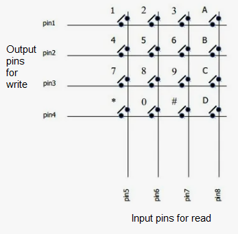

# MatrixKeyboard
simple matrix keyboard for MCU, example for STM32

  

An example for STM32 controllers can be found in the file matrix_keyboard_conf.h.

You need to call the matrix_keyboard_task() function in your program every few tens of milliseconds;

When a key is pressed or released on the keyboard, the matrix_keyboard_press and matrix_keyboard_unpress functions are called with column and row parameters. Both functions must be written in your program.
